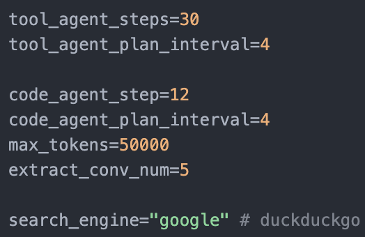
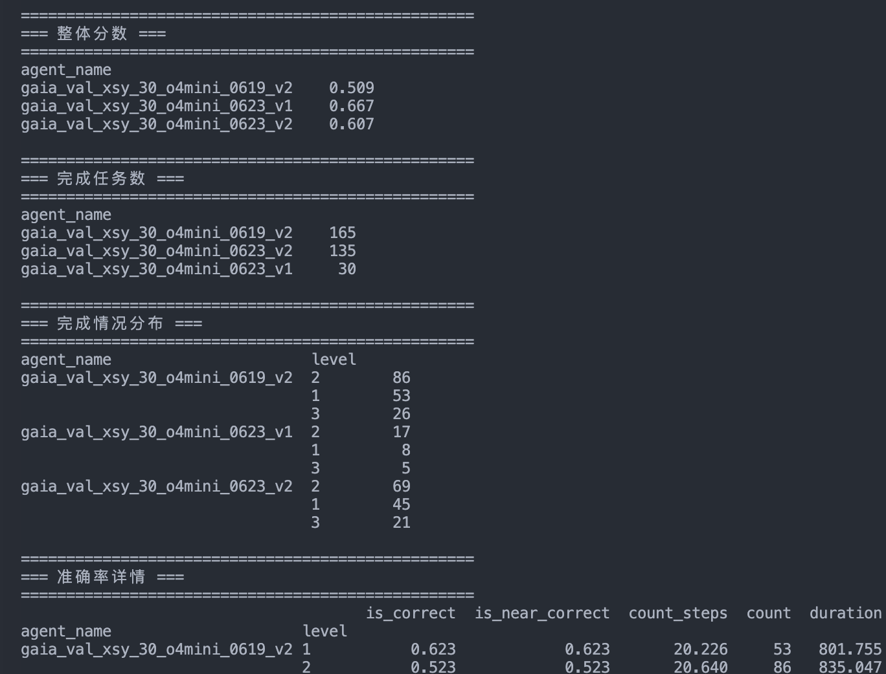
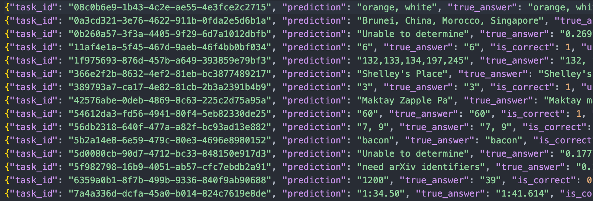

# 主程序

执行主程序前启动 `python -m phoenix.server.main serve`，方便跟踪trace

然后再开个终端启动agent

```powershell
nohup python run_gaia.py --concurrency 10 --run_name gaia_val_xsy_o4mini_0618_v1 --model_id o4-mini >> log/gaia_val_xsy_o4mini_0618_v1.log 2>&1 < /dev/null & 
```

结果文件保存在 `validation/ {run_name}.jsonl`中

## 关键配置



---

# 后处理

1. 运行完成后，执行 `python evaluate_result.py --split validation`获取评估结果，split为想评测文件所在的文件夹名称，文件夹需要在output路径下

   
2. 可以运行 `convert_compare.py`来方便进行结果对比：

```powershell
python convert_compare.py --file_path otuput/validation/{your_result.jsonl}
```

    结果保存在`output/camparing/`文件夹下



3. 对于某些结果提取可能有问题的，可以在 `extract_test.ipynb`中单独提取和测试prompt

---

## 潜在优化点

CodeAgent和ToolAgent的系统prmopt，可以查看链接内smolagent的大概流程，有大量agent可以改

[https://joyspace.jd.com/pages/W7RXTS4C5qo4uuCKsxt9](https://joyspace.jd.com/pages/W7RXTS4C5qo4uuCKsxt9)
