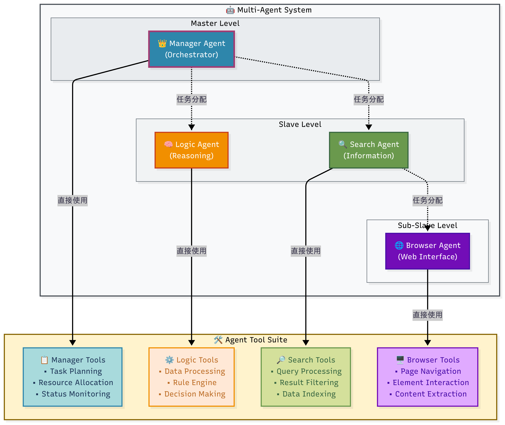
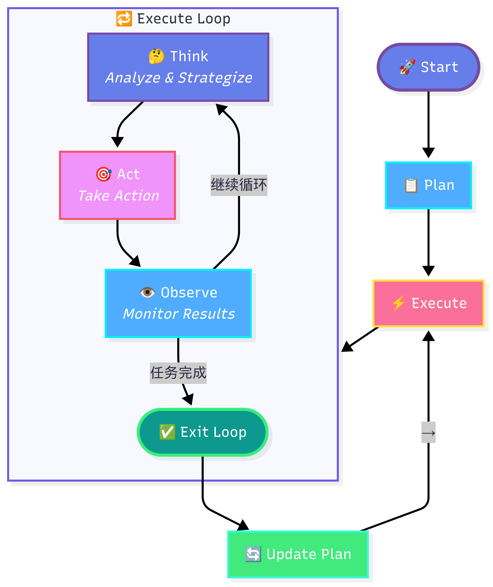

# Project for gaia benchmark with smolagents framework

This project implements a sophisticated multi-agent system to tackle complex reasoning and task-solving challenges, specifically targeting the [GAIA benchmark](https://huggingface.co/datasets/gaia-benchmark/GAIA). It leverages the `smolagents` library to create a team of specialized AI agents that collaborate to answer questions and complete tasks.

<div align="center">
  
  
</div>

The core architecture follows a manager-worker pattern:

- A **Manager Agent** oversees the entire process, breaking down complex questions into smaller, manageable sub-tasks.
- A **Retrieval Expert Agent** specializes in gathering information from various sources, including web search, Wikipedia, Arxiv, and GitHub.
- A **Logic Expert Agent** excels at programming, logical reasoning, and mathematical calculations, using the information provided to derive final answers.
- A **Browser Expert Agent** excels at gathering web information through browser-use style with `playwright` mcp.

## ✨ Features

- **Multi-Agent System**: Utilizes a hierarchical team of agents for robust problem-solving.
- **Extensible Toolset**: Integrates a wide array of tools for web crawling, document parsing (PDF, DOCX, HTML), media processing (images, audio, YouTube), and scientific data analysis.
- **Code-First Agents**: Agents generate and execute Python code to perform actions, enabling complex logic and dynamic tool use.
- **GAIA Benchmark Ready**: Designed to run and evaluate tasks from the GAIA dataset out-of-the-box.
- **Observability**: Integrated with Phoenix/OpenInference for detailed tracing and monitoring of agent behavior.

## 🚀 Getting Started

Follow these steps to set up and run the GAIA-Agent system.

### 1. Prerequisites

- Python 3.9+
- An environment variable file (`.env`) with your API keys:
  ```bash
  OPENAI_API_KEY=
  OPENAI_BASE_URL=

  MINERU_BASE_URL=https://mineru.net/api/v4
  MINERU_API_TOKEN=

  SERPAPI_API_KEY=

  PHOENIX_API_KEY=
  PHOENIX_COLLECTOR_ENDPOINT=

  GITHUB_API_TOKEN=

  GOOGLE_API_KEY=
  ```

### 2. Installation

1. Clone the repository:
   ```bash
   git clone <repository_url>
   cd <repository_directory>
   ```
2. Install the required Python packages:
   ```bash
   pip install -r requirements.txt
   ```
3. Download the GAIA dataset and place it in the `data/` directory as instructed on the [Hugging Face dataset page](https://huggingface.co/datasets/gaia-benchmark/GAIA). Your directory structure should look like this:
   ```
   data/
   └── gaia/
   ```

### 3. Running the Agents

Execute the main script to start processing tasks from the GAIA dataset. Each task runs in a dedicated workspace to isolate its files and logs.

```bash
python run_gaia.py --run_name "my_first_run" --concurrency 4
```

**Command-Line Arguments:**

- `--run_name`: A unique name for your execution run. Outputs will be saved under this name. (Default: `gaia_run`)
- `--concurrency`: The number of tasks to run in parallel. (Default: `10`)
- `--split`: The dataset split to use (`validation` or `test`). (Default: `validation`)
- `--use_phoenix`: (Flag) Enable to send traces to Phoenix for monitoring.

## 📁 Project Structure

```
.
├── data/                 # GAIA dataset files
├── logs/                 # Execution logs for each task
├── output/               # Raw and processed results from agent runs
├── prompts/              # YAML prompt templates for the agents
├── smolagents/           # The smolagents library submodule
├── src/                  # Core source code
│   ├── tools/            # Custom tools for the agents
│   ├── extractor.py      # Extracts final answers from agent output
│   └── utils.py          # Utility functions
├── workspaces/           # Isolated directories for each task run
├── evaluate_result.py    # Script to score the agent's predictions
├── requirements.txt      # Project dependencies
└── run_gaia.py           # Main script to launch the agent system
```

## 📊 Evaluation

After a run completes, you can evaluate the performance of the agents against the ground truth answers. The `run_gaia.py` script automatically attempts to extract the final answer from the agent's conversation history.

To calculate the final scores, run the evaluation script:

```bash
python evaluate_result.py
```

This will process the output files located in `output/<split>/<run_name>.jsonl` and generate a report with accuracy and other metrics.

## 🛠️ Core Components

### smolAgents

This project is built upon the `smolagents` library, which provides the foundation for creating code-first, tool-augmented agents. The core logic for the agents, their interaction loops, and tool integration is handled by this powerful and lightweight framework. See the `smolagents/` directory for more details.

### Prompts

The behavior and personality of each agent are defined by prompt templates located in the `prompts/` directory. These YAML files structure the system prompts, planning instructions, and task-specific guidelines for the Manager, Retrieval, and Logic agents.

### Tools

The agents are equipped with a wide range of tools located in `src/tools/`. These are standard Python functions that agents can call to interact with the outside world. Below is a detailed list of the available tools:

| Tool Name                       | Description                                                                                                                           | File                     |
| :------------------------------ | :------------------------------------------------------------------------------------------------------------------------------------ | :----------------------- |
| `ArxivWebSearchTool`          | Performs advanced searches on ArXiv for scientific papers, with support for field-specific queries and date filtering.                | `arxiv_tool.py`        |
| `audio_parse_tool`            | Transcribes various audio formats (WAV, MP3, M4A, FLAC) using the OpenAI Whisper model.                                               | `audio_tool.py`        |
| `CrawlWebpageTool`            | Accesses and extracts formatted content (Markdown or HTML) from webpages.                                                             | `crawler_tool.py`      |
| `CrawlerArchiveWebpageTool`   | Retrieves archived versions of webpages from the Wayback Machine for a specific date.                                                 | `crawler_tool.py`      |
| `doc_parse_tool`              | Parses and extracts content from Microsoft Office documents (Word, Excel, PowerPoint).                                                | `doc_tool.py`          |
| `download_file`               | Downloads files from URLs with support for various formats and saves them locally.                                                    | `download_tool.py`     |
| `final_answer`                | Submits the final answer to the given problem.                                                                                        | `final_answer_tool.py` |
| `GitHubRepoSearchTool`        | Searches for GitHub repositories with advanced filtering options.                                                                     | `github_tool.py`       |
| `GitHubIssueSearchTool`       | Searches for issues within a specified GitHub repository.                                                                             | `github_tool.py`       |
| `GitHubPullRequestSearchTool` | Searches for pull requests within a specified GitHub repository.                                                                      | `github_tool.py`       |
| `GitHubReleaseSearchTool`     | Lists releases for a repository or retrieves a specific release by tag.                                                               | `github_tool.py`       |
| `html_parse_tool`             | Parses and extracts content from local HTML files.                                                                                    | `html_tool.py`         |
| `image_parse_tool`            | Analyzes image content using a Vision Language Model (VLM), providing descriptions or answering questions about the image.            | `image_tool.py`        |
| `ocr_tool`                    | Extracts text from images using Optical Character Recognition (OCR).                                                                  | `ocr_tool.py`          |
| `pdf_parse_tool`              | Extracts text and images from PDF files, preserving table structures.                                                                 | `pdf_tool.py`          |
| `PDFParseTool`                | An advanced tool for parsing PDFs, with options to use either a traditional library or a VLM for extraction.                          | `pdf_tool_v2.py`       |
| `pdb_parse_tool`              | Parses and analyzes Protein Data Bank (PDB) files for molecular and structural data.                                                  | `scientific_tool.py`   |
| `IntegratedSearchTool`        | A comprehensive web search tool that can use multiple search engines (Google, Bing, DuckDuckGo).                                      | `search_tool.py`       |
| `text_parse_tool`             | A general-purpose tool for parsing various text-based files, including plain text, Markdown, and structured data formats (JSON, CSV). | `text_tool.py`         |
| `WikiSearchTool`              | Searches Wikipedia for articles, with options for year filtering.                                                                     | `wikipedia_tool.py`    |
| `WikiPageTool`                | Retrieves and cleans the content of a Wikipedia page from a given URL.                                                                | `wikipedia_tool.py`    |
| `visit_ytb_page`              | Parses a YouTube video page to extract structured information like title, description, and stats.                                     | `youtube_tool.py`      |
| `get_ytb_screenshot`          | Captures a screenshot from a YouTube video at a specified timestamp.                                                                  | `youtube_tool.py`      |
| `get_ytb_subtitle`            | Downloads subtitles for a YouTube video in a specified language.                                                                      | `youtube_tool.py`      |
| `get_ytb_audio`               | Extracts the audio track from a YouTube video and saves it as an MP3 file.                                                            | `youtube_tool.py`      |
| `extract_zip_file`            | Extracts the contents of a ZIP archive to a specified directory.                                                                      | `zip_tool.py`          |
